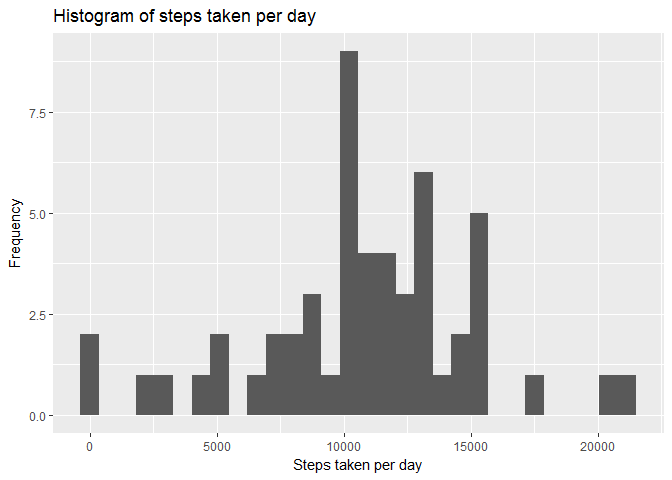
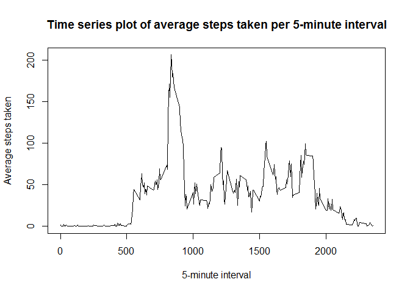
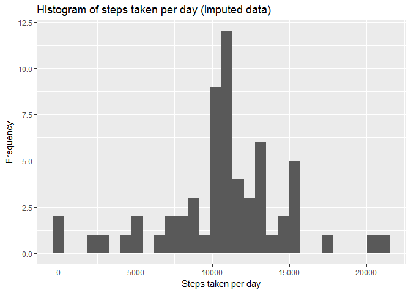

# Reproducible Research: Peer Assessment 1

## Setup

**Clear workspace**


```r
rm(list = ls())
```

**Set working director**


```r
setwd("C:/Users/maschigoda/Desktop/coursera/5. Reproducible research/RepData_PeerAssessment1")
```

**Load packages**


```r
library(knitr)
library(dplyr)
library(lubridate)
library(ggplot2)
```

## Loading and preprocessing the data

**Load data**


```r
data <- read.table(unz("activity.zip", "activity.csv"), header=T, sep=",", colClasses = c("numeric", "character", "integer"))
```

**Reformat date variable**


```r
data$date <- ymd(data$date)
```

## What is mean total number of steps taken per day?

**Make histogram of total number of steps taken each day**


```r
steps_day <- data %>%
  filter(!is.na(steps)) %>%
  group_by(date) %>%
  summarize(steps = sum(steps)) 


qplot(steps_day$steps, geom="histogram", main = "Histogram of steps taken per day", xlab = "Steps taken per day", ylab = "Frequency") 
```

<!-- -->

**Calculate and report the mean and median total number of steps taken per day**

- Mean steps taken per day:

```r
mean(steps_day$steps, na.rm = TRUE)
```

```
## [1] 10766.19
```


- Median= steps taken per day:

```r
median(steps_day$steps, na.rm = TRUE)
```

```
## [1] 10765
```

## What is the average daily activity pattern?

**Make a time series plot (i.e. type = "l") of the 5-minute interval (x-axis) and the average number of steps taken, averaged across all days (y-axis)**


```r
plot(unique(data$interval), tapply(data$steps, data$interval, mean, na.rm=TRUE), type="l", main = "Time series plot of average steps taken per 5-minute interval", xlab = "5-minute interval", ylab = "Average steps taken")
```

<!-- -->

**Which 5-minute interval, on average across all the days in the dataset, contains the maximum number of steps?**


```r
avg_steps <- data %>%
  filter(!is.na(steps)) %>%
  group_by(interval) %>%
  summarize(steps = mean(steps)) 

max_steps <- as.data.frame(avg_steps[which.max(avg_steps$steps),])
```

- Interval with max number of steps: 

```r
max_steps$interval
```

```
## [1] 835
```

## Imputing missing values 
**(Note that there are a number of days/intervals where there are missing values (coded as NA). The presence of missing days may introduce bias into some calculations or summaries of the data.)**

**Calculate and report the total number of missing values in the dataset (i.e. the total number of rows with NAs)**

- Total number of missing vlues in the dataset:

```r
sum(is.na(data$steps))
```

```
## [1] 2304
```

**Devise a strategy for filling in all of the missing values in the dataset. The strategy does not need to be sophisticated. For example, you could use the mean/median for that day, or the mean for that 5-minute interval, etc.**   

The strategy is to fill in missing values with the mean for that 5-minute interval, as found in avg_steps.

**Create a new dataset that is equal to the original dataset but with the missing data filled in.**  


```r
data_imputed <- data

data_imputed$steps[is.na(data_imputed$steps)] <- avg_steps$steps[match(data_imputed$interval[is.na(data_imputed$steps)],avg_steps$interval)]
```

**Check to make sure there is no missing data**

```r
sum(is.na(data_imputed$steps))
```

```
## [1] 0
```

**Make a histogram of the total number of steps taken each day.**  


```r
steps_day_imputed <- data_imputed %>%
  group_by(date) %>%
  summarize(steps = sum(steps)) 


qplot(steps_day_imputed$steps, geom="histogram", main = "Histogram of steps taken per day (imputed data)", xlab = "Steps taken per day", ylab = "Frequency") 
```

<!-- -->

**Calculate and report the mean and median total number of steps taken per day.**   

- Mean steps taken per day:

```r
mean(steps_day_imputed$steps)
```

```
## [1] 10766.19
```


- Median= steps taken per day:

```r
median(steps_day_imputed$steps)
```

```
## [1] 10766.19
```

**Do these values differ from the estimates from the first part of the assignment? What is the impact of imputing missing data on the estimates of the total daily number of steps?**  

- The mean stays the same, but the median increases by 1.19.
  
## Are there differences in activity patterns between weekdays and weekends? 
**(For this part the weekdays() function may be of some help here. Use the dataset with the filled-in missing values for this part.)**  

**Create a new factor variable in the dataset with two levels -- "weekday" and "weekend" indicating whether a given date is a weekday or weekend day.**   


```r
data_imputed <- mutate(data_imputed, weektype = ifelse(weekdays(data_imputed$date) == "Saturday" | weekdays(data_imputed$date) == "Sunday", "weekend", "weekday"))
data_imputed$weektype <- as.factor(data_imputed$weektype)
```

**Make a panel plot containing a time series plot (i.e. type = "l") of the 5-minute interval (x-axis) and the average number of steps taken, averaged across all weekday days or weekend days (y-axis).**   


```r
interval_imputed <- data_imputed %>%
  group_by(interval, weektype) %>%
  summarise(steps = mean(steps))

ggplot(interval_imputed, aes(x=interval, y=steps, color = weektype)) +
  geom_line() +
  facet_wrap(~weektype, ncol = 1, nrow=2)
```

<!-- -->
